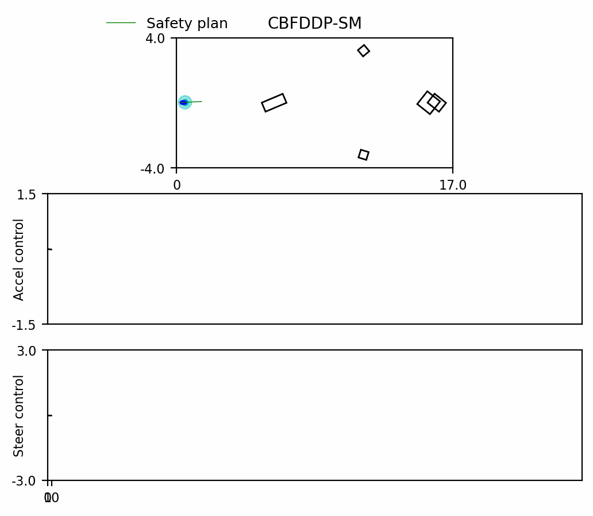
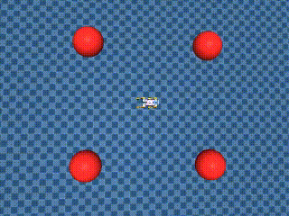

# CBF-DDP V2 with Soft Operators

This repository provides CBF-DDP with soft minimum and maximum operators, replacing the hard operators used in the initial version (https://github.com/SafeRoboticsLab/CBF_DDP). All changes are contained in the main branch. The branch `singular_point_reproduction` is used to explore local minima and singular phenomena in reach-avoid DDP.

## Usage instructions

There are two minor variations of the same methods: one intended to work with our own simulators, and the other designed to work with the Brax-MJX simulation interface. We rely on Anaconda for setting up our Python environment. The `bicycle_jax_supported_env.yml` is best suited for our own simulators. The `brax_env.yml` is best suited for the MJX simulations. The user is free to mix the versions, but the code may not be perfectly reproducible across versions.

### RaceCar 

The race car is based on the setup in `simulators/car/*.py`, with the dynamics implemented in `simulators/dynamics/*.py`. We provide the option for `Bicycle4D`, `Bicycle5D`, and `PointMass4D` dynamics for the racecar setup. Point-mass dynamics reuses the same configurations and costs for the point mass, mixing the terms used to denote the state variables. 

To run the race-car setup, examples are provided in `test_scripts_ilqr_task.sh` and `test_scripts_naive_task.sh`.

```
# Bicycle 4D reach-avoid - baseline line search, road boundary 2.5 in each direction, rollout stopping path.
python evaluate_soft_ddpcbf_bic.py -cf ./test_configs/reachavoid/test_config_cbf_reachavoid_circle_config_multiple_obs_1_bic4D.yaml -rb 2.5 -ls 'baseline' -sp 'rollout'

# Bicycle 5D reach-avoid - baseline line search, road boundary 3.0 in each direction, analytic stopping path.
python evaluate_soft_ddpcbf_bic.py -cf ./test_configs/reachavoid/test_config_cbf_reachavoid_circle_config_multiple_obs_1_bic5D.yaml -rb 3.0 -ls 'baseline' -sp 'analytic'

# Bicycle 5D reachability - trust region line search, road boundary 3.5 in each direction.
python evaluate_soft_ddpcbf_bic.py -cf ./test_configs/reachability/test_config_cbf_reachability_circle_config_multiple_obs_2_bic5D.yaml -rb 3.5 -ls 'trust_region_tune_margin'

# Bicycle 5D reachability - trust region line search, road boundary 3.5 in each direction, use naive task instead of default ILQR task policy.
python evaluate_soft_ddpcbf_bic.py -cf ./test_configs/reachability/test_config_cbf_reachability_circle_config_multiple_obs_2_bic5D.yaml -rb 3.5 -ls 'trust_region_tune_margin' --naive_task
```
#### Reachability Rollout with CBFDDP-SM on the Bicycle 5D dynamics.
<p align="center">

</p>

#### Reach-avoid Rollout with CBFDDP-SM on the Bicycle 5D dynamics.
<p align="center">

</p>

Provided are:
* four options for line search - `baseline`, `armijo`, `trust_region_constant_margin`, `trust_region_tune_margin`
* Naive task or ILQR task policy
* `analytic` stopping path or `rollout` stopping path based on reach-avoid

The test configs in `./test_configs/` contain the configuration options required to tune the filters. Tuning must be performed as described in the supporting document to achieve the desired results. The environment offers the option to provide `Circle`, `Box`, and `Ellipse` obstacles.

The choice of safety filter is hard-coded in `evaluate_soft_ddpcbf_bic.py` with the options - `SoftCBF`, `CBF`, `LR`, `SoftLR`. Additional instructions on operating each safety filter will be provided. The safety filter option may be provided as a command-line argument in a future release.

### 2D Planar vertical takeoff and landing

The PVTOL6D is based on the code in `simulators/aerialV/*.py` with the dynamics implemented in `simulators/dynamics/*.py`. We perform the following test for the PVTOL dynamics from [here](https://python-control.readthedocs.io/en/0.9.4/pvtol-lqr-nested.html).

#### Reachability Rollout with CBFDDP-SM on the PVTOL 6D dynamics.
<p align="center">

</p>

```
python evaluate_soft_ddpcbf_pvtol.py -cf ./test_configs/pvtol/test_config_circle_reach_obs1_pvtol6D.yaml
```

### Brax Reacher and MJX Barkour

We test our method on MJX baselines while using Brax to interface with the MJX backend.

To run the Reacher experiment, use `python run_mjx_brax_simulations.py --env 'reacher'`. 
The seed is hardwired inside the code. Please use it to your convenience to test solutions and compare with ours. The reacher setup is dependent on whether the `linear` mode QP solver (with an affine constraint) or the `quadratic` mode QCQP constraint solver is used. You may need to make hardwired changes in `./brax_utils/configs/reacher.yaml` depending on your experiment. The $\gamma$ factor is tuned to convenience. The margin functions used are described in `brax_utils/costs/reacher_margin.py` 

To run barkour, use `python run_mjx_brax_simulations.py --env 'barkour'`. 
Hardwired changes may be required in `./brax_utils/configs/barkour.yaml` if the experiment design differs from ours. The margin functions used are described in `brax_utils/costs/barkour_margin.py` 

#### MJX-Brax Barkour with CBF-DDP
<p align="center">

</p>

#### MJX-Brax Barkour with LR-DDP
<p align="center">

</p>

#### Remark

The Brax setup was not entirely conducive to retrieving a sufficient state and to retrieving the derivative flow along this adequate state. The author projects the generalized pipeline state to generalized coordinates and applies additional nuances to recover the derivative flow of the reduced state.

## Acknowledgements

This code is based on the previous codebase of Safe Robotics Lab in Princeton ( https://saferobotics.princeton.edu/ )

## Citation

A. Ramesh Kumar, K. -C. Hsu, P. J. Ramadge and J. F. Fisac, "Fast, Smooth, and Safe: Implicit Control Barrier Functions Through Reach-Avoid Differential Dynamic Programming," in IEEE Control Systems Letters, vol. 7, pp. 2994-2999, 2023, doi: 10.1109/LCSYS.2023.3292132.

TBD
